  

  

##  About Me
- 🎓 Final Year Computer Science Engineering Student
- 💻 Aspiring Software Engineer | Problem Solver
- 🚀 Building real-world projects with AI & Blockchain
- 🎯 Focus Area:
- 🔹 Software Development (Backend + Problem Solving)
- 🔹 AI/ML Applications & Data-Driven Systems
- 🔹 Blockchain-based Solutions
- 🛠️ Tech Stack:
- 🔹 Python | C++ | JavaScript
- 🔹 MySQL | HTML | CSS
- 📊 Project: GST Evasion Detection using AI + Blockchain
- 📚 Currently mastering Data Structures & System Design
- 🌱 Open to Internship & Entry-Level Opportunities
- 📫 Let’s connect and build something impactful

## 🧠 My Focus Areas
- Web Development
- AI/ML Research
- Open Source Contributor

## 📊 GitHub Stats & Trophies

  
  

  

  

  

## 🛠️ Languages & Tools

> ## Programming Languages

   

> ## Frontend

    

> ## Backend

   

> ## Database

  

> ## DevOps & Cloud

   

> ## Tools

    

  

## 🔗 Connect with Me

  

<picture>
  <source media="(prefers-color-scheme: dark)" srcset="https://raw.githubusercontent.com/abozanona/abozanona/output/pacman-contribution-graph-dark.svg">
  <source media="(prefers-color-scheme: light)" srcset="https://raw.githubusercontent.com/abozanona/abozanona/output/pacman-contribution-graph.svg">
  
</picture>

  

